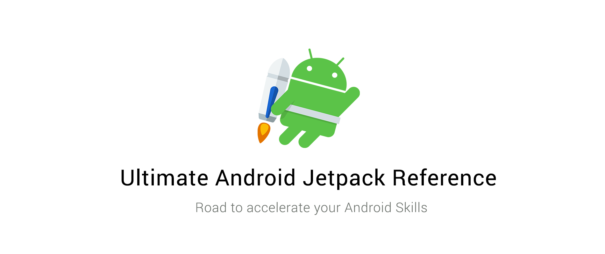

# Ultimate Android Jetpack Reference

       <br />

> What's Android Jetpack

Android Jetpack is the next generation of components and tools along with Architectural guidance designed to accelerate Android Development. The main reasons are:
* Build high quality, robust apps
* Eliminate boilerplate code
* Accelerate development

#### Show Some :heart: by

[](https://github.com/SyamSundarKirubakaran/Android-Jetpack) [](https://github.com/SyamSundarKirubakaran) [](https://twitter.com/bugscripter)

## Categories

* [Architecture components](#architecture-components)
  - [Room](#room)
  - [ViewModel](#ViewModel)
  - [LiveData](#LiveData)
  - [Lifecycles](#Lifecycles)
  - [Data Binding](#data-binding)
  - [Paging](#Paging)
  - [Navigation](#Navigation)
  - [WorkManager](#WorkManager)
* Foundation components
  - AppCompat
  - Android KTX
  - Multidex
  - Test
* Behaviour Components
  - Download manager
  - Media & playback
  - Notifications
  - [Permissions](#Permissions)
  - Sharing
  - Slices
* UI components
  - Animation & transitions
  - Auto
  - Emoji
  - Fragment
  - Layout
  - Palette
  - TV
  - [Wear OS by Google](#wearosbygoogle)
  
## Architecture Components

* <b>Room</b>
    - Fluent SQLite database access using Object Mapping Technique.
    - <b>Need:</b>
        - Less Boiler Plate code .i.e., Sends data to the SQLite database as Objects and not as Content Values and returns the result of executing a query as Objects as Cursors. 
        - Compile time validation of SQLite Queries.
        - Support for Observations like Live Data and RxJava
    - Makes use of Annotations for it's functioning and makes the API simple and neat to use.
    - <b>Annotations:</b>
        - <b>@Entity:</b> Defines the schema of the database table.
        - <b>@dao:</b> Stands for Database Access Object, used to perform read or write operations on the database
        - <b>@database:</b> As a database Holder. Creates a new Database based on supplied conditions, if it already exists it establishes a connection to the pre-existing database.
    - <b>Code:</b>
        - <b>@Entity:</b>
          ```java
                @Entity(tableName = "word_table")
                public class Word {
                    @PrimaryKey
                    @NonNull
                    @ColumnInfo(name = "word")
                    private String mWord;
                    public Word(String word) {this.mWord = word;}
                    public String getWord(){return this.mWord;}
                }
          ```
          Most of the annotations are self-explanatory where the <b>@Entity</b> takes in and declares the tableName of the table that's about to be created (if tableName is not mentioned the table takes up the name of the class, here in this case : Word) and the class also has a number of optional attributes like setting the column name(if node specified it takes up the name of the varibale), It's important to note that the all the declarations inside the entity class are considered as columns of the database.(Here "one" .i.e., mWord). You can make use of <b>@Ignore</b> annotation to ignore a declaration as a column in your database. 
        - Room should have access to the member varaibles of the Entity class .i.e., it should be able to set or reset or update the value stored in a member variable and hence note that though the member variable is declared as private there is a public constructor and a getter to access the member variable.
        - <b>@dao:</b>
            ```java
                @Dao
                public interface WordDao {
                    @Insert
                    void insert(Word word);
                    @Query("DELETE FROM word_table")
                    void deleteAll();
                    @Query("SELECT * from word_table ORDER BY word ASC")
                    List<Word> getAllWords();
                }
            ```
            Note that Dao should be an <b>abstract class</b> or <b>an interface</b>. The remaining are self explanatory and as said earlier notice that the querying out from the database returns a list of objects in this case .i.e., List<Word> and no a Cursor.<br>
        - If you replace `List<Word>` by `LiveData<List<Word>>` then it happens to return an updated list of objects for every change in the database. This is one of the prime principles of <b>LiveData</b>
        - <b>@database:</b>
            ```java
                @Database(entities = {Word.class}, version = 1)
                public abstract class WordRoomDatabase extends RoomDatabase {
                    public abstract WordDao wordDao();
                }
            ```
            Note that this has to be <b>abstract</b> and extend the class <b>RoomDatabase</b>. Entities contain the database tables that has to be created inside the database and there should be an abstract getter method for <b>@doa</b>
        - <b>Database Connection:</b>
            ```java
                WordRoomDatabase db = Room.databaseBuilder(context.getApplicationContext(),
                            WordRoomDatabase.class, "word_database")
                            .fallbackToDistructiveMigration()
                            .build();
            ```
            Here, `.fallbackToDistructiveMigration()` is an optional attribute that signifies if the database schema is changed wipe out all the data existing in the currently existing database.
            Creating multiple instances of the database is expensive and is not recommended and hence keeping it as a singleton(which can have only one instance of the class) can come in handy.
        - <b>Additional Hints</b>
            - Use `@PrimayKey(autoGenerate = true)` to auto generate the primary key, it's usually applied to Integer values and hence starts from 1 and keeps incrementing itself.
            - To pass a value of a member variable into the query make use of `:` .i.e.,
            `@Query("SELECT * from word_table ORDER BY word LIKE :current_word")`
            - Create and Make use of a <b>Repository class</b> to handle the Data Operations. You can handle custom logics such as if you're fetching data from the network but there is no existing connection to the internet, then you'll have to fetch and display the cached data or from dao.
        
* <b>View Model</b>
    - Manage UI-related data in a lifecycle-conscious way.
    - Since it survives configuration changes it has the potential to replace AsyncTask Loaders.
    - <b>Need:</b>
        - High decoupling of UI and Data.
        - No gaint activities with too many responsibilities.
        - UI Controller displays data.
        - ViewModel holds the UI Data.
    - <b>Reason:</b>
    - Say for an instance you're having an Activity that has a number of UI elements and that will have it's state updated based on the user inputs and now when the device undergoes configuration change the data will be lost since the activity has been recreated due to the configuration change. Of course, you can make use of `onSavedInstanceState()` but having forgotten a single field shall lead to inconsistency in the app, here is where <b>ViewModel</b> comes in to play things smart.
    - Here in ViewModel since the UI data is decoupled from the activity lifecycle it can out-live the impact made by configuration changes on the data. Therefore, after recreation of the activity the UI Data can be fetched from the ViewModel to update the UI respectively.
    - <b>Representation:</b><br>
        <p align="center">
            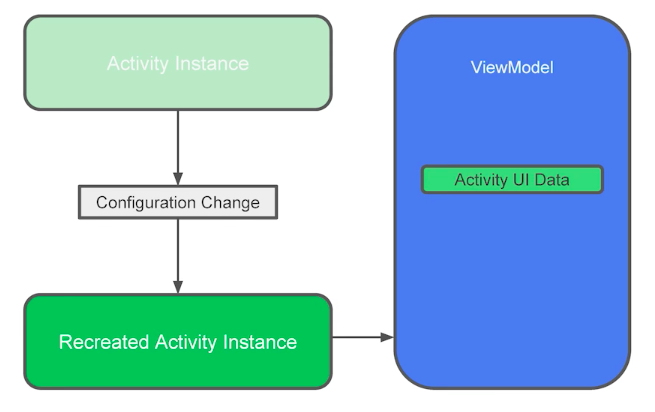
        </p>
    - <b>Code:</b>
        - Extend from `ViewModel` or `AndroidViewModel`
            ```java
                public class MyViewModel extends ViewModel {
                    // Should contain all the UI Data (As LiveData if possible)
                    // Getters and Setters
                }
            ```
        - Linking `ViewModel` to the Activity
            ```java
                public class MyActivity extends AppCompatActivity {
                    public void onCreate(Bundle savedInstanceState) {
                        // Create a ViewModel the first time the system calls an activity's onCreate() method.
                        // Re-created activities receive the same MyViewModel instance created by the first activity.
                        // ViewModelProvider provides ViewModel for a given lifecycle scope.
                        MyViewModel model = ViewModelProviders.of(this).get(MyViewModel.class);
                        model.getUsers().observe(this, users -> {
                            // update UI
                        });
                    }
                }
            ```
        - <b>Important Note:</b>
            - `View Model` can survive:
                - Configuration Changes
            - `View Model` doesn't survive:
                - Pressing Back .i.e., Destroying the activity.
                - Killing the Activity through Multi-tasking.
            - `View Model` is not a replacement for:
                - Presistence
                - onSavedInstanceState
            - Linked to the `Activity lifecycle` and <b>not</b> with the `App lifecycle`.
            
* <b>Live Data:</b>
    - Notify views when underlying database changes
    - <b>Need:</b>
        - Reactive UI.
        - Updates only on reaching `onStart()` and `onResume()`.
        - Cleans up itself automatically.
        - Allows communication with Database to the UI without knowing about it.
    - <b>Representation:</b><br>
        <p align="center">
            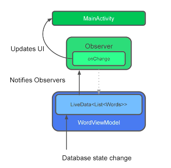
        </p>
    - <b>Code:</b>
        - LiveData can be made possible for `String` using `MutableLiveData<String>`
        - To update the UI with real-time data from Live-Data we can make use of a pattern similar to the Observer Pattern.
            ```java
                mModel.getCurrentName().observe(this, new Observer<String>() {
                    @Override
                    public void onChanged(@Nullable final String newName) {
                        // Update the UI, in this case, a TextView.
                        mTextView.setText(newName);
                    }
                });
            ```
        - Here, `mModel` is the ViewModel instance and assume `getCurrentName()` returns a `MutableLiveData<String>` and the observer is set over it which invocates `onChanged()` when the data in the MutableLiveData changes.
        - <b>Arguments:</b>
            - `this` : Specifies the activity that it has the work on .i.e., <b>LifeCycleOwner</b>
            - `Observer<type>` : <b>type</b> depends on the return type of the Live Data.

* <b>Life Cycle</b>
    - <b>Terms:</b>
        - <b>Lifecycle:</b> An Object that defines Android Lifecycle.
        - <b>Lifecycle Owner:</b> It's an interface:
            - Objects with Lifecycles
            - eg. Activities and Fragments.
        - <b>LifecycleObserver:</b> Observes LifecycleOwner.
    - <b>Code:</b>
        - Let's say we want a Listener that has to be Lifecycle aware:
            ```java
                public class MyObserver implements LifecycleObserver {
                    @OnLifecycleEvent(Lifecycle.Event.ON_RESUME)
                    public void connectListener() {
                        ...
                    }
                    @OnLifecycleEvent(Lifecycle.Event.ON_PAUSE)
                    public void disconnectListener() {
                        ...
                    }
                }
                lifecycleOwner.getLifecycle().addObserver(new MyObserver());
            ```
        - Now perform action based on the current state of the Activity or Fragment.
            ```java
                public class MyObserver implements LifecycleObserver {
                    public void enable(){
                        enable = true;
                        if(lifecycle.getState().isAtleast(STARTED)){
                            // action after onStart is reached
                        }
                }
            ```
    - <b>Important Note:</b>
        - Initially Lifecycle Library was kept optional but now it has become a fundamental part of Android development and the AppCompatActivity and Fragment class inherit from the Lifecycle Library out of the box.
            ```kotlin
                class AppCompatActivity : LifecycleOwner
                class Fragment : LifecycleOwner
            ```
            
* <b>Data Binding</b>
    - Declaratively bind observable data to UI elements.
    - It's a proven solution for boiler plate free UIs.
    - <b>Code:</b><br>
        ```kotlin
            data class User(val name: String, ... )
        ```
        ```xml
            <layout>
            <data>
                <variable name="user" type="User"/>
            </data>
            <TextView android:text="@{user.name}"/>
            </layout>
        ```
        - Here the code is self-explanator, Consider you're having a `data  class` in Kotlin that has a number of fields that has the real-time data that has to be updated in the UI then it can be directly parsed in the XML document of the UI by creating an appropriate variable for accessing the <b>data class</b> as shown above.
    - <b>Important Note:</b>
        - They have native support for LiveData and hence LiveData can be used similar to the above shown instance.
        - But this is not enough to observe it since data binding doesn't have a lifecycle. This can be fixed by adding a LifecycleOwner while creating a binding instance.
            ```kotlin
                binding.setLifecycleOwner(lifecycleOwner)
            ```
        - This can help keep the data in the UI upto date with the LiveData.
    
* <b>Paging</b>
    - Gradually load information on demand from your data source.
    - In other words, Lazy loading for Recycler View.
    - <b>Need</b>
        - Convenience
        - Multiple Layer
        - Performance
        - Lifecycle aware
        - Flexible with different background API and Data Structures.
    - If there is a very large list of data to be loaded it's very in-efficient in handling memory       constraints also the source of data can be from different locations like some from <b>cloud</b>    and others from <b>database</b> if the network in not available and so on.<br>  
    - Paging library comes with a `PagedList` class which is a Java List implementation that works       with a data source Asynchronously.
    - Every time you access an item in the PagedList it pulls data from the data source Lazily .i.e.,   on scrolling brings in more data from the data source.
    - One of the most common problems is that, if the data is fetched from data source that has         thousands of rows returned as a result of query these thousand words are kept ready to inflate      it in the UI even though the user can see only 8 - 10 rows of the query result. This is in-         efficient(Note that the recycler view can only help in handling the resorces by recycling the     list item resources and it has nothing to do with the data). Here is where the Paging stands      up by providing data on-demand (when the user scrolls) to the recycler view.
    - <b>Code:</b>
        - Works great if `Room` is used.
        - Paging is a bit compicated to explain with simple code samples since it involves a recycler   view. But we would highly recommend you going through the <a href="https://codelabs.developers.google.com/codelabs/android-paging/index.html#0">Codelab</a>   for paging and checkout the paging <a href="https://github.com/googlesamples/android-architecture-components/tree/master/PagingWithNetworkSample">Sample app</a> so that you get a   much more clear picture of it. 
        - It is highly similar to creating a recycler view and involves some changes in the Adapter     (as PageListAdapter) and LiveData.
    - <b>Important Note:</b>
        - Paging supports <b>RxJava.</b>
        - <b>ListAdapter</b>
            ListAdapter is a RecyclerView Adapter thet displays a list. 
            ```kotlin
                // Call 1
                listAdapter.submitList(listOf(1,2,3,4))
                // Call 2
                listAdapter.submitList(listOf(1,3,4))
                // when second statement is executed after executing 1st it simply removes '2' because it finds the difference between the two updates in the background thread and perform UI update correspondingly. This makes it efficient.
            ```
        - Allows <b>Place Holders</b>
            - <b>Without</b> using Place holders:
                Considers the list size as the size of the list until it's paged and once we've reached the bottom of the paged items the scroll bar jumps to the middle of the scroll interface and we can scroll through the next set of list items that are paged after reaching the end of the firstly paged list. This is not so good in principle and even worse when it comes to handling animation of the scroll bar.
            - <b>With</b> Place Holders:
                The size of the entire list is taken until the item data becomes null then the contents that are paged are displayed in the list and remaning are shown in the form of place holders which are enabled by default, once they are paged the data will fill up those place holders.<br>
                <p align="center">
                    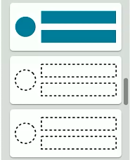
                </p>
            - Depends on the Data Source like
                - Positional Data Source (best option)
                    - Jump to the middle of the list using scroll then start paging from the initial     position visible .i.e., visible placeholder.
                - ItemKeyed Data Source
                    - Given a page, the previous page can be identified using first item in the list     and the following item can be identified using the last item in the list. If the   data source is updated in the mean-while fetch the page sized list from the       beginning element of the visible list and perform diff and inflate the changes.
                - PageKeyed Data Source
                    - Used in server-side APIs.
                    - Representation:<br>
                      <p align="center">
                        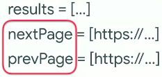
                      </p>
                - The <b>best</b> way:
                    - Representation:<br>
                        <p align="center">
                        <b>I</b><br>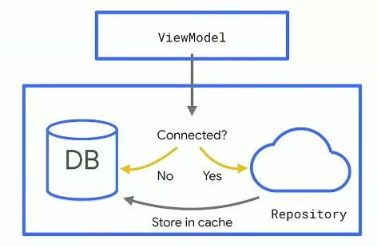<br>
                        <b>II</b><br>
                        </p>
                    - The first technique is not so efficient because of the following reasons:
                        - Poor network.
                        - Not using local data form the Database though they are present.
                    - This is over come by the second technique which is self explanatory.
                
* <b>Navigation</b>
    - Handle everything needed for in-app navigation.
    - <b>Need:</b>
        - Animations.
        - Argument Passing with type safety.
        - Up and Back button press behaviour.
        - DeepLink handling.
        - No more Fragment transactions.
    - It's a visual component added in Android Studio which helps user define flow in their app from     one activity to an other or from one fragment to an other.
    - Say for an instance if a user enters into your app using deep links and on pressing back/up       button the user should be taken to the previous screen in the app and should not exit the app.     This hierarchy can be easily defined using navigation.
    - The preceeding activities/fragments are pushed into the `back stack` as the deep link is clicked   and going back shall lead to popping of contents from the back stack to reach the previous         screens.
    - <b>Representation:</b><br>
        <p align="center">
            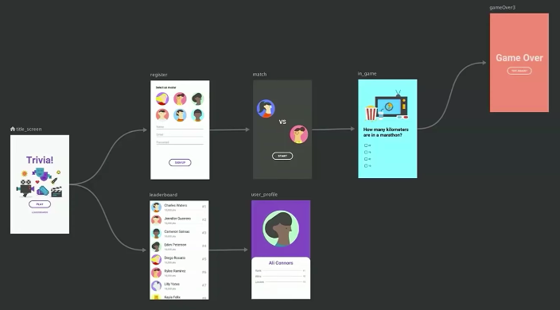
        </p>
    - The control flow is shown by using pointed arrows to the succeeding activities.

* <b>Work Manager</b>
    - Manage your Android background jobs.
    - <b>Need</b>
        - Solution for <b>Deferrable Garanteed Execution</b>.
            - This means when any of the following tasks happen and if the user is not connected to     the network then the tasks should be reserved and once the network connection is           restored the appropriate task has to be done.
            - Tasks
                - Sending a tweet
                - Uploading logs
                - Periodic data sync
    - This is a successor (kinda) of JobScheduler and Firebase Job Dispacher since the problem with     the latters is that, it's hard to implement and has different behaviours and different APIs.
    - <b>Concepts:</b>
        - <b>Workers</b> which executes the actions.
        - <b>Work Managers</b> which trigger the workers.
    - <b>Code:</b>
        ```kotlin
            // Extend from the worker class
            class CompressWorker : Worker()  {
                //implement the doWork()
                override fun doWork(): Result {
                    return Result.SUCCESS
                }
            }
        ```
        - Set Constraints:
            ```kotlin
                val myConstraints = Constraints.Builder()
                                    .setRequiresDeviceIdle(true)
                                    .setRequiresCharging(true)
                                    .build()

                val compressionWork = OneTimeWorkRequestBuilder<CompressWorker>()
                                    .setConstraints(myConstraints)
                                    .build()
            ```
        - Additionals:
            - `.setBackoffCriteria` mention what to do if the task is failing.
            - Pass in arguments like:
                ```kotlin
                    .setInputData(
                        mapOf("sample" to "sample1").toWorkData()
                    )
                ```
        - Invocation:
            - Get an instance of the <b>WorkManager</b> and enqueue the work
                ```kotlin
                    WorkManager.getInstance().enqueue(work)
                ```
    - <b>Input and Output semantics</b>
        - Not only takes Input but also provide Output data. This can be accomplished by observing the data through <b>WorkManager</b>
    - <b>Architecture</b>
        <p align="center">
            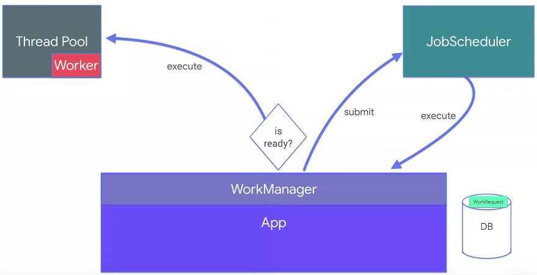
        </p>
    - <b>Special Case</b>
        - Consider a senario in which we have an image that has to be processed and uploaded to the server. Here we have 2 tasks, where task 1 .i.e., Image Processing can be done without a network and task 2 .i.e., Uploading to server requires a network. This can be easily accomplished using Work Manager.
            ```kotlin
                // Create 2 classes for the 2 tasks
                class ImageProcessing : Worker()
                class Upload : Worker()
                
                fun createImageWorker(image : File) : OneTimeWorkRequest{
                    ...
                }
                
                val processImageWork = createImageWorker(file)
                
                //constraint to upload only in the presence of Network
                val constraint = Constraints.Builder()
                                 .setRequiredNetworkType(NetworkType.CONNECTED)
                                 .build()
                                
                val uploadImageWork = OneTimeWorkRequestBuilder<UploadImageWorker>()
                                      .setConstraints(constraints)
                                      .build
                                    
                // Starts with image processing and then initiates upload
                WorkManager.getInstance()
                           .beginWith(processImageWork)
                           .then(UploadImageWork)
                           .enqueue()
            ```
    - <b>Important Note</b>
        - Similar to the above scenario not just 2 but a number of work can be enqueued in the WorkManager by providing proper constraints.
            ```kotlin
                WorkManager.getInstance()
                            // First, run all the A tasks (in parallel):
                            .beginWith(workA1, workA2, workA3)
                            // ...when all A tasks are finished, run the single B task:
                            .then(workB)
                            // ...then run the C tasks (in any order):
                            .then(workC1, workC2)
                            .enqueue()
            ```
        - Opportunistic Execution is ensured. Consider you're sending an email this job is scheduled to JobScheduler or Firebase JobDispacher but the problem is we're not sure of how much time it would take to complete the task and we have no control over it and hence results in a bad user experience. To work arround this we'll have a <b>Thread Pool</b> and run the same thing there as well and we take care of replicating when the JobScheduler calls us back. This can be completely taken care by Work Manager now.

## Behaviour Components

* <b>Permissions</b>
    - <b>Need:</b>
        - Android apps require permissions from the user to access sensitive Data from the device.
        - Normal permissions such as
            - `ACCESS_NETWORK_STATE`
            - `ACCESS_WIFI_STATE`
            - `SET_WALLPAPER`
            - `VIBRATE`
            - `WAKE_LOCK` etc
            are provided by the Android system itself. 
        - However Dangerous permissions like,
            - `READ_CALL_LOG`
            - `CAMERA`
            - `READ_CONTACTS`
            - `RECORD_AUDIO`
            - `ACCESS_FINE_LOCATION` 
            - `ACCESS_COARSE_LOCATION` etc that can affects user's privacy require explicit permissions from the user.
        - In <b>Android 5.1.1</b>(Lollipop - API 22) or lower requests all dangerous permissions in the install time itself. If they are granted, only then the app will be installed
        - In <b>Android 6.0</b> (Marshmallow - API 23 or newer) requests the dangerous permissions only at the runtime. 
        - So your app should always check and request permissions at runtime to prevent [security Exceptions](https://developer.android.com/reference/java/lang/SecurityException) and app crashing.
        
    - <b>Representation:</b>
        - <b>Runtime Permissions</b><br>
            <p align="center">
                
            </p>
        - <b>Install Time permissions</b><br>
            <p align="center">
                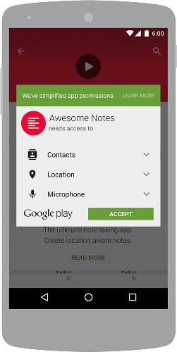
            </p>

    - <b>Code:</b>
        - <b>In the App Manifest:</b>
          Add the required `uses-permission` tag as a child to the Manifest element
          ```xml
              <manifest xmlns:android="http://schemas.android.com/apk/res/android">
                <uses-permission android:name="android.permission.SEND_SMS"/>
                <!-- other permissions go here -->
                <application ...>
                    ...
                </application>
              </manifest>
          ```
        - <b>In the Activity requiring the permission:</b>
            ```java
                // Here, thisActivity is the current activity
                if (ContextCompat.checkSelfPermission(thisActivity,
                        Manifest.permission.READ_CONTACTS)
                        != PackageManager.PERMISSION_GRANTED) {
                    // Permission is not granted
                    // Should we show an explanation why.
                    if (ActivityCompat.shouldShowRequestPermissionRationale(thisActivity,
                            Manifest.permission.READ_CONTACTS)) {
                        // Show an explanation to the user *asynchronously* -- don't block
                        // this thread waiting for the user's response! After the user
                        // sees the explanation, try again to request the permission.
                    } else {
                        // No explanation needed; request the permission
                        ActivityCompat.requestPermissions(thisActivity,
                                new String[]{Manifest.permission.READ_CONTACTS},
                                MY_PERMISSIONS_REQUEST_READ_CONTACTS);
                        // MY_PERMISSIONS_REQUEST_READ_CONTACTS is an
                        // app-defined int constant. The callback method gets the
                        // result of the request.
                    }
                } else {
                    // Permission has already been granted
                }
            ```
        - <b>Handling the user's response:</b>
            - After the user grants or denies the permission, the system invoke onRequestPermissionsResult method. Your App must override the method and handle the functionality if the permission is granted, or disable that particular functionality if denied. If the user denies the permission for multiple times the system them also shows the dialog with the `Never Ask Again` checkbox. Hence always check if the permission is available at runtime.
            ```java
                @Override
                public void onRequestPermissionsResult(int requestCode, String permissions[], int[] grantResults) {
                    switch (requestCode) {
                        case MY_PERMISSIONS_REQUEST_READ_CONTACTS: {
                            // If request is cancelled, the result arrays are empty.
                            if (grantResults.length > 0 && grantResults[0] == PackageManager.PERMISSION_GRANTED) {
                                // permission was granted, yay! Do the
                                // contacts-related task you need to do.
                            } else {
                                // permission denied, boo! Disable the
                                // functionality that depends on this permission.
                            }
                            return;
                        }
                        // other 'case' lines to check for other
                        // permissions this app might request.
                    }
                }
            ```
        - <b>Permissions of Optional Hardware:</b><br>
            - For using certain harware features such as camera or GPS your app needs permission. However not all devices posses all the required hardwares. So, in the Android Manifest file request for the permission as shown below,
            ```xml
                <uses-feature android:name="android.hardware.camera" android:required="false" />
            ```
            - Unless the <b>android:required</b> attribute is specified to false, your app will be listed "only" to devices that have the hardware.

## UI Components

- Wear OS by Google

    - Material Design 

    - A design language with a set of rules, guidelines, components and best practices for creating websites and applications.

    - Need:

        - Color palettes (Darker palettes allow for better battery life for OLEDs)
        - Adopt vertical layouts
        - Horizontal swipe (Reserved for activity dismissal)
        - Make use of user interface components

    - Code:

        - Generating a palette instance:

        ```java
                    // Generate palette synchronously and return it
        			public  Palette createPaletteSync(Bitmap bitmap)  {
        			    Palette p =  Palette.from(bitmap).generate();  
        			    return p; 
        			   
        			    // Generate palette asynchronously and use it on a different  
        			    // thread using onGenerated()
        			    public  void createPaletteAsync(Bitmap bitmap)  {
        			        Palette.from(bitmap).generate(new  PaletteAsyncListener()  {
        			        public  void onGenerated(Palette p)  {
        			        // Use generated instance  }  });  
        				} 
        			   
        			}
        ```

        - Representation:

        - <b>Wear OS Palette List</b><br>
            <p align="center">
                
            </p>

        - <b>Corresponding Wear OS UI</b><br>
            <p align="center">
                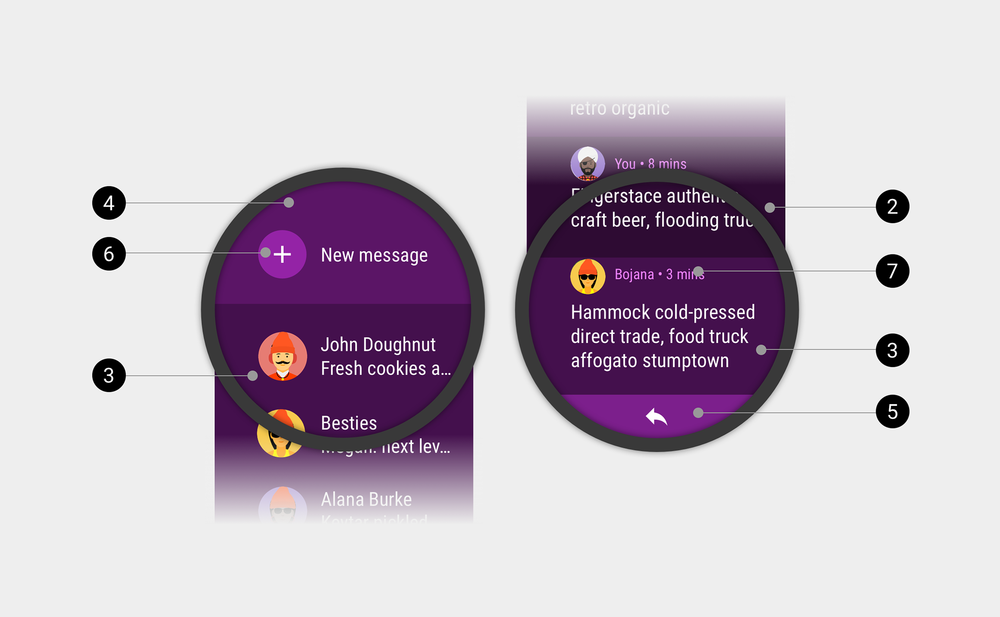
            </p>
        - Vertical Layout

        ```xml
        <LinearLayout xmlns:android="http://schemas.android.com/apk/res/android"
        	// Retrieves the tools 
        	xmlns:tools="http://schemas.android.com/tools"
        	// Sets default height and width to depend on a parent
        	android:layout_width="match_parent" 
        	android:layout_height="match_parent"
        	// Sets default orientation to vertical
        	android:orientation="vertical">
            // Sets text for app face
        	<TextView  android:id="@+id/text"  
        		android:layout_width="wrap_content"  
        		android:layout_height="wrap_content"  
        		android:text="@string/hello_square"  />  
        	</LinearLayout>
        ```

        - Horizontal Swipe for Dismissing Activities:

        ```java
        public class SwipeDismissFragment extends Fragment {
        		private final Callback mCallback =
        			new Callback() {
        				@Override
        					public void onSwipeStart() {
        					// optional
        				}
        				@Override
        					public void onSwipeCancelled() {
        					// optional
        				}
        				@Override
        				public void onDismissed(SwipeDismissFrameLayout layout) {
        					// Code here for custom behavior such as going up the
        					// back stack and destroying the fragment but staying in the app.
        				}
              };
        	@Override
        	public View onCreateView(LayoutInflater inflater, ViewGroup container, Bundle savedInstanceState) {
        		SwipeDismissFrameLayout swipeLayout = new SwipeDismissFrameLayout(getActivity());
        		// If the fragment should fill the screen (optional), then in the layout file,
        		// in the android.support.wear.widget.SwipeDismissFrameLayout element,
        		// set the android:layout_width and android:layout_height attributes
        		// to "match_parent".
        		View inflatedView = inflater.inflate(R.layout.swipe_dismiss_frame_layout, swipeLayout, false);
        		swipeLayout.addView(inflatedView);
        		swipeLayout.addCallback(mCallback);
        		return swipeLayout;
        		}
        	}
        ```

    - Representation:
        - <b>Do:</b><br>
            <p align="center">
                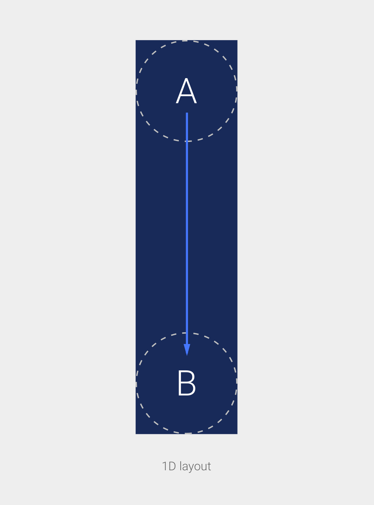
            </p>
        - <b>Do Not:</b><br>
            <p align="center">
                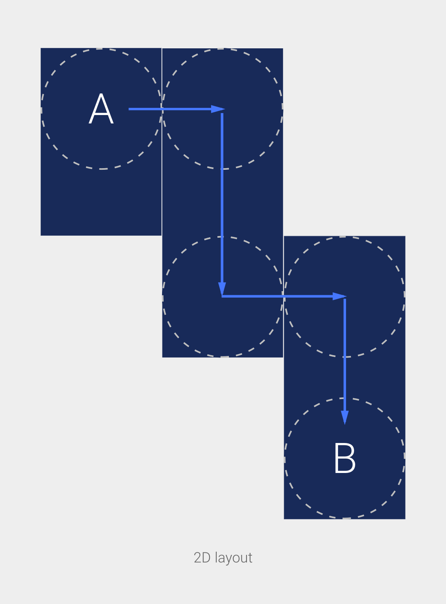
            </p>
        - Using both vertical and horizontal scrolling can make traversing apps confusing, Stick to vertical.


    * Watch Face Complications

        * Complications are features of a watch face that are displayed in addition to the time. The Complications API allows for seamless integration with API calls.

        * Need:

            * Exposing data to complications
            * Adding complications to a watch face

        * Code:

            * Exposing data to complications

             ```java
            @Override
            public void onComplicationUpdate(
                int complicationId, int dataType, ComplicationManager complicationManager) {
         
                Log.d(TAG, "onComplicationUpdate() id: " + complicationId);
         
                // Used to create a unique key to use with SharedPreferences for this complication.
                ComponentName thisProvider = new ComponentName(this, getClass());
         
                // Retrieves your data, in this case, we grab an incrementing number from SharedPrefs.
                SharedPreferences preferences =
                  getSharedPreferences( ComplicationTapBroadcastReceiver.COMPLICATION_PROVIDER_PREFERENCES_FILE_KEY, 0);
         
                int number =
                        preferences.getInt(
                                ComplicationTapBroadcastReceiver.getPreferenceKey(
                                        thisProvider, complicationId),
                                0);
                String numberText = String.format(Locale.getDefault(), "%d!", number);
         
                ComplicationData complicationData = null;
         
                switch (dataType) {
                    case ComplicationData.TYPE_SHORT_TEXT:
                        complicationData =
                            new ComplicationData.Builder(ComplicationData.TYPE_SHORT_TEXT)
                                .setShortText(ComplicationText.plainText(numberText))
                                .build();
                    break;
                default:
                    if (Log.isLoggable(TAG, Log.WARN)) {
                        Log.w(TAG, "Unexpected complication type " + dataType);
                    }
            }
         
            if (complicationData != null) {
                complicationManager.updateComplicationData(complicationId, complicationData);
         
            } else {
                // If no data is sent, we still need to inform the ComplicationManager, so
                // the update job can finish and the wake lock isn't held any longer.
                complicationManager.noUpdateRequired(complicationId);
                }
            }
            ```
    Discussion:

    To respond to update requests from the system, your data provider app must implement the onComplicationUpdate() method of the `ComplicationProviderService` class.  This method will be called when the system wants data from your provider - this could be when a complication using your provider becomes active, or when a fixed amount of time has passed.

    * Adding complications to a watch face

        * Setting other data providers

            ```java
            startActivityForResult(
                ComplicationHelperActivity.createProviderChooserHelperIntent(
                getActivity(),
                watchFace,
                complicationId,
                ComplicationData.TYPE_LARGE_IMAGE),
            PROVIDER_CHOOSER_REQUEST_CODE);
            ```

        * Representation:
            
        - <b>Complications on a Watchface:</b><br>
                <p align="center">
                    
            </p>

    Discussion:

    Watch faces can call the createProviderChooserHelperIntent method to obtain an intent that can be used to show the chooser interface. When the user selects a data provider, the configuration is saved automatically; nothing more is required from the watch face.

    * Receiving complication data

        ```java
        private void initializeComplicationsAndBackground() {
            ...
            mActiveComplicationDataSparseArray = new SparseArray<>(COMPLICATION_IDS.length);
            
            // Creates a ComplicationDrawable for each location where the user can render a
            // complication on the watch face. In this watch face, we create one for left, right,
            // and background, but you could add many more.
            ComplicationDrawable leftComplicationDrawable =
                new ComplicationDrawable(getApplicationContext());
        
            ComplicationDrawable rightComplicationDrawable =
                new ComplicationDrawable(getApplicationContext());
            
            ComplicationDrawable backgroundComplicationDrawable =
                new ComplicationDrawable(getApplicationContext());
        
                // Adds new complications to a SparseArray to simplify setting styles and ambient
                // properties for all complications, i.e., iterate over them all.
                mComplicationDrawableSparseArray = new SparseArray<>(COMPLICATION_IDS.length);
            
                mComplicationDrawableSparseArray.put(LEFT_COMPLICATION_ID,              leftComplicationDrawable);
                mComplicationDrawableSparseArray.put(RIGHT_COMPLICATION_ID,             rightComplicationDrawable);
                mComplicationDrawableSparseArray.put(
                    BACKGROUND_COMPLICATION_ID, backgroundComplicationDrawable);
            
                // Recieves data from complication ids within the array
                setComplicationsActiveAndAmbientColors(mWatchHandHighlightColor);
                        setActiveComplications(COMPLICATION_IDS);
                    }
            ```

    Discussion: A watch face calls setActiveComplications(), in the WatchFaceService.Engine class, with a list of watch face complication IDs. A watch face creates these IDs to uniquely identify slots on the watch face where complications can appear. Complication data is delivered via the onComplicationDataUpdate() callback.

    * Stand Alone Functionality

        * The use of a Wear OS application to communicate with the cloud without the requirement of a corresponding bridge application on your Android smartphone. Wear OS also has the Google Play store in order to download applications straight to a Wear OS device

        * Need:

            * Standalone Identifier

        * Code:

        * Standalone Identifier

            ```xml
            <application>
            ...
            <meta-data
                android:name="com.google.android.wearable.standalone"
                // android value of true means the Wear OS application is standalone
                // value is false if it is dependant on a phone application
                android:value="true" />
            ...
            </application>
            ```

        Discussion:

        Since a standalone app (that is, an independent or semi-independent app) can be installed by an iPhone user or a user of an Android phone that lacks the Play Store, the watch app should be usable without the phone app.


### TODO

    - Complete the remaining components : work in Progress.!
        
### License
```
   Copyright 2018 Syam Sundar K

   Licensed under the Apache License, Version 2.0 (the "License");
   you may not use this file except in compliance with the License.
   You may obtain a copy of the License at

       http://www.apache.org/licenses/LICENSE-2.0

   Unless required by applicable law or agreed to in writing, software
   distributed under the License is distributed on an "AS IS" BASIS,
   WITHOUT WARRANTIES OR CONDITIONS OF ANY KIND, either express or implied.
   See the License for the specific language governing permissions and
   limitations under the License.
```

### Contributions
Just make pull request. You are in